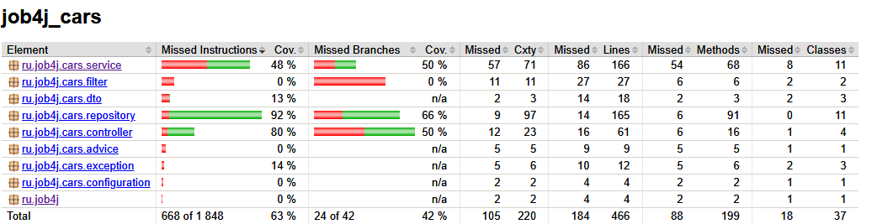
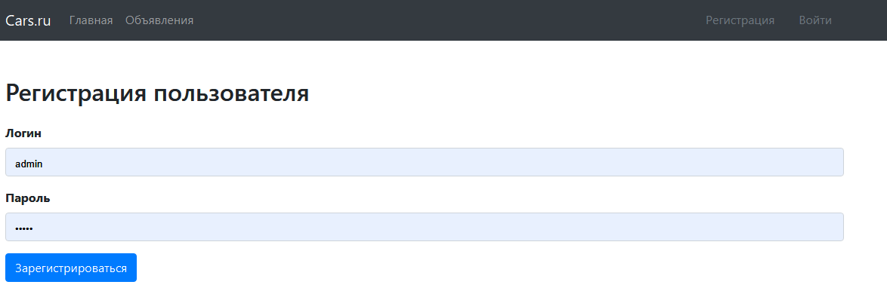
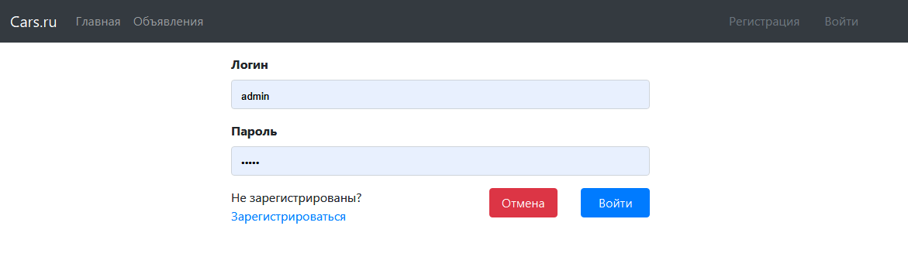
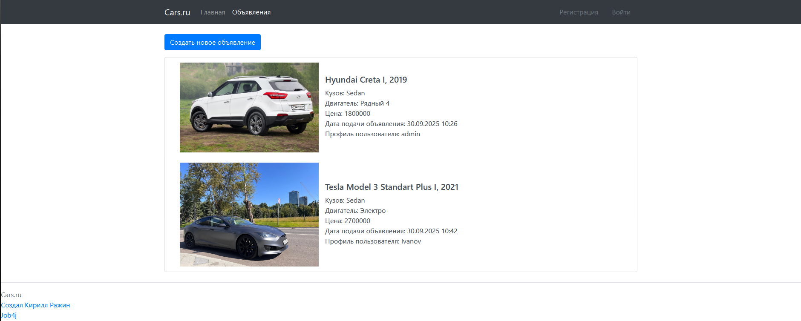
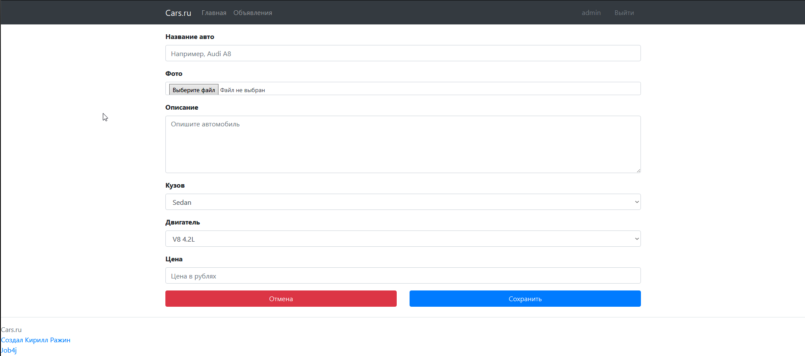
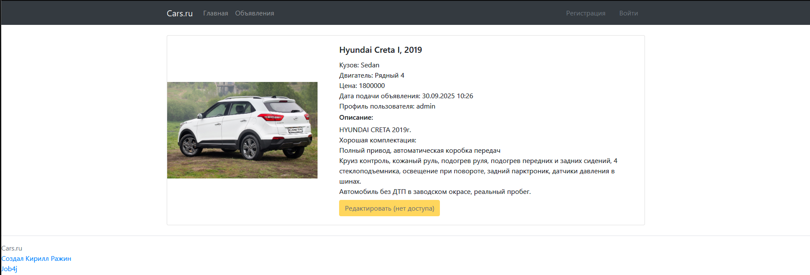
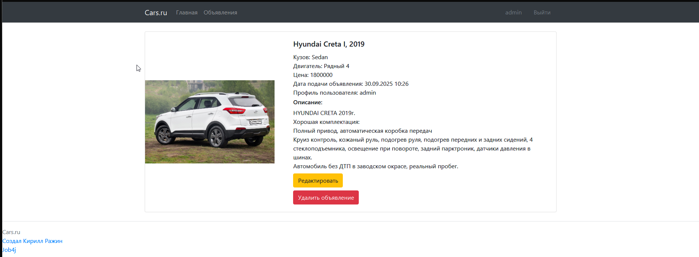
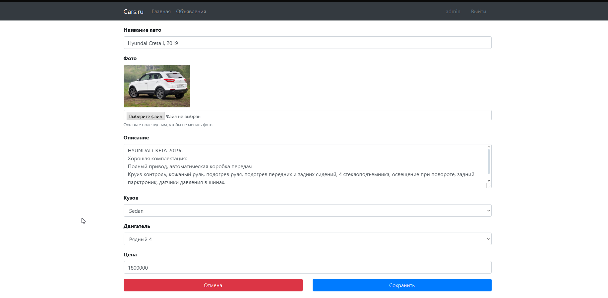

# job4j_cars
## Описание
Данный сайт является проектом по продаже автомобилей. Мы имеем возможность публиковать объявления и просматривать информацию. Владелец объявления может его редактировать и удалять
## Используемые технологии
- java 21
- PostgreSQL 
- Maven 
- Liquibase 
- Spring boot-web 
- Spring boot-thymeleaf 
- Hibernate 
- H2 db 
- Lombok 
- Jacoco 
## Процент покрытия тестами

## Интерфейс приложения
- ### Страница регистрации пользователя
  
- ### Страница авторизации пользователя
  
- ### Страница с объявлениями
  
- ### Страница создания объявления(только авторизованные пользователи)
  
- ### Страница объявления(гость или не владелец объявления)
  
- ### Страница объявления(владелец объявления)
  
- ### Страница редактирования объявления владельцем
  
  
  
  
  
  
  